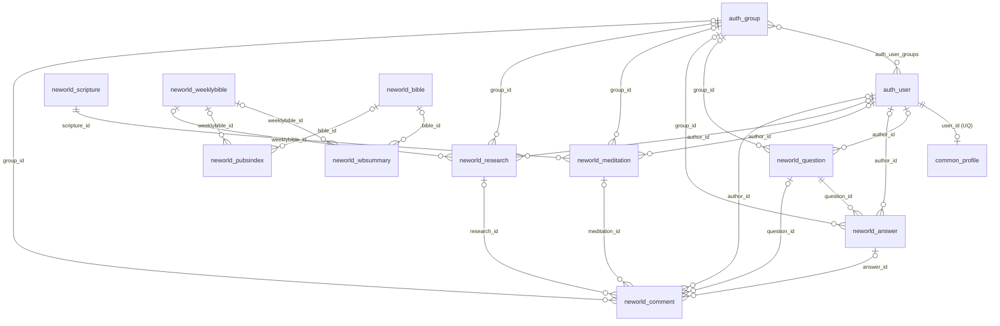

# 물리 ERD (SQLite 개발 / PostgreSQL 운영)

기준: 현재 모델과 마이그레이션(`common` 0013, `neworld` 0027), 그리고 운영 설정 [`config/settings/prod.py`](config/settings/prod.py).
운영 DBMS는 PostgreSQL, 개발 DBMS는 SQLite이다. 아래 정의는 Django가 생성·관리하는 물리 테이블 기준이며, `PK`, `FK`, `UQ`는 각각 기본키·외래키·유니크 제약을 뜻한다.

## 1. 핵심 테이블 관계

`neworld_weeklybible`·`neworld_bible`에서 시작하는 3개 FK와 모든 `author_id`·`group_id`·댓글 대상 FK는 nullable이다.

## 2. 애플리케이션 테이블

| 테이블 | 컬럼 (PostgreSQL 기준) | 키·제약 |
|---|---|---|
| `common_profile` | `id integer`, `user_id integer`, `bio text NULL`, `website_url varchar(200) NULL` | PK `id`; UQ/FK `user_id → auth_user.id` |
| `neworld_question` | `id integer`, `author_id integer NULL`, `group_id integer NULL`, `subject varchar(200)`, `content text`, `create_date timestamptz`, `modify_date timestamptz NULL` | PK `id`; FK `author_id → auth_user`, `group_id → auth_group` |
| `neworld_answer` | `id integer`, `question_id integer`, `author_id integer NULL`, `group_id integer NULL`, `content text`, `create_date timestamptz`, `modify_date timestamptz NULL` | PK `id`; FK `question_id → neworld_question`, `author_id → auth_user`, `group_id → auth_group` |
| `neworld_scripture` | `id integer`, `scripture varchar(400)`, `bodytext text`, `real_date varchar(10)`, `d_week varchar(50) NULL`, `create_date timestamptz` | PK `id`; UQ `real_date` (`scripture_real_date_uniq`) |
| `neworld_meditation` | `id integer`, `scripture_id integer`, `author_id integer NULL`, `group_id integer NULL`, `meditation text`, `real_date varchar(10)`, `create_date timestamptz`, `modify_date timestamptz NULL` | PK `id`; FK `scripture_id → neworld_scripture`, `author_id → auth_user`, `group_id → auth_group` |
| `neworld_weeklybible` | `id integer`, `year integer`, `n_week integer`, `week varchar(100)`, `bible_range varchar(100)`, `bible_link varchar(200) NULL`, `specific_id varchar(50) NULL`, `create_date timestamptz` | PK `id`; UQ (`year`, `n_week`) (`weeklybible_year_week_uniq`) |
| `neworld_bible` | `id integer`, `bible_id varchar(10)`, `bible varchar(30) NULL` | PK `id`; UQ `bible_id` (`bible_bible_id_uniq`) |
| `neworld_wbsummary` | `id integer`, `weeklybible_id integer NULL`, `bible_id integer NULL`, `chapter varchar(10)`, `bible_summary text`, `specific_id varchar(50) NULL`, `create_date timestamptz` | PK `id`; FK `weeklybible_id → neworld_weeklybible`, `bible_id → neworld_bible` |
| `neworld_pubsindex` | `id integer`, `weeklybible_id integer NULL`, `bible_id integer NULL`, `chapter varchar(10)`, `index_verse varchar(50)`, `pi_title varchar(50)`, `pi_link varchar(200) NULL`, `specific_id varchar(50) NULL`, `create_date timestamptz` | PK `id`; FK `weeklybible_id → neworld_weeklybible`, `bible_id → neworld_bible` |
| `neworld_research` | `id integer`, `weeklybible_id integer NULL`, `author_id integer NULL`, `group_id integer NULL`, `content text`, `create_date timestamptz`, `modify_date timestamptz NULL` | PK `id`; FK `weeklybible_id → neworld_weeklybible`, `author_id → auth_user`, `group_id → auth_group` |
| `neworld_comment` | `id integer`, `author_id integer NULL`, `group_id integer NULL`, `question_id integer NULL`, `answer_id integer NULL`, `meditation_id integer NULL`, `research_id integer NULL`, `content text`, `create_date timestamptz`, `modify_date timestamptz NULL` | PK `id`; 각 `*_id`는 해당 테이블 FK; CHECK `comment_exactly_one_target` |

## 3. Django 인증 및 M:N 연결 테이블

| 테이블 | 컬럼 | 키·제약 |
|---|---|---|
| `auth_user` | `id integer`, `password varchar(128)`, `last_login timestamptz NULL`, `is_superuser boolean`, `username varchar(150)`, `first_name varchar(150)`, `last_name varchar(150)`, `email varchar(254)`, `is_staff boolean`, `is_active boolean`, `date_joined timestamptz` | PK `id`; UQ `username` |
| `auth_group` | `id integer`, `name varchar(150)` | PK `id`; UQ `name` |
| `auth_user_groups` | `id integer`, `user_id integer`, `group_id integer` | PK `id`; FK 2개; UQ (`user_id`, `group_id`) |
| `neworld_question_voter` | `id integer`, `question_id integer`, `user_id integer` | PK `id`; FK 2개; UQ (`question_id`, `user_id`) |
| `neworld_answer_voter` | `id integer`, `answer_id integer`, `user_id integer` | PK `id`; FK 2개; UQ (`answer_id`, `user_id`) |
| `neworld_meditation_voter` | `id integer`, `meditation_id integer`, `user_id integer` | PK `id`; FK 2개; UQ (`meditation_id`, `user_id`) |
| `neworld_research_voter` | `id integer`, `research_id integer`, `user_id integer` | PK `id`; FK 2개; UQ (`research_id`, `user_id`) |

> Django 기본 테이블 중 권한 관리용 `auth_permission`, `auth_group_permissions`, `auth_user_user_permissions`, `django_content_type`와 운영 메타데이터용 `django_migrations`, `django_session`, `django_admin_log`는 업무 모델 ERD 범위에서 제외했다.

## 4. DBMS별 구현 차이

| Django 필드 | PostgreSQL 운영 | SQLite 개발 |
|---|---|---|
| `AutoField` PK | `integer` PK와 시퀀스/identity 생성 방식 | `INTEGER PRIMARY KEY` (`rowid` 기반) |
| `CharField`, `URLField`, `EmailField` | `varchar(n)` | `varchar(n)` 선언이나 길이 강제는 느슨함 |
| `TextField` | `text` | `text` |
| `DateTimeField` + `USE_TZ=True` | `timestamp with time zone` | `datetime` 저장; 시간대 보존 방식은 Django 변환에 의존 |
| `BooleanField` | `boolean` | 통상 정수 `0`/`1` |

## 5. 물리 제약 및 주의사항

- 명시적인 `Meta.indexes` 및 `unique_together`는 없다. `UniqueConstraint`로 `WeeklyBible(year, n_week)`, `Scripture(real_date)`, `Bible(bible_id)`의 중복을 방지한다. Django는 FK 컬럼 및 M:N 조인 테이블의 FK 조합 유니크 제약에 필요한 인덱스를 생성한다.
- `create_date`의 `auto_now_add=True`는 Django ORM이 값을 채우는 동작이며, DB의 `DEFAULT CURRENT_TIMESTAMP` 제약이 아니다. ORM 밖에서 INSERT하는 경우 값을 직접 제공해야 한다.
- 모델의 `on_delete=models.CASCADE`는 Django 삭제 수집기에서 적용되는 규칙이다. PostgreSQL의 실제 FK DDL에 `ON DELETE CASCADE`가 자동으로 들어간다고 가정하면 안 된다. ORM을 우회한 SQL 삭제 시에는 DB FK 제약에 맞게 하위 행을 먼저 처리해야 한다.
- `neworld_comment`는 `comment_exactly_one_target` CHECK 제약으로 댓글 대상 FK 4개 중 정확히 하나만 채워지도록 강제한다.
- 운영 PostgreSQL에 이미 적용된 정확한 PK sequence/identity DDL은 **마이그레이션을 실행한 Django 버전**에 따라 달라질 수 있다. 위 문서는 애플리케이션이 보장하는 컬럼 타입·키·제약을 기준으로 한다.
